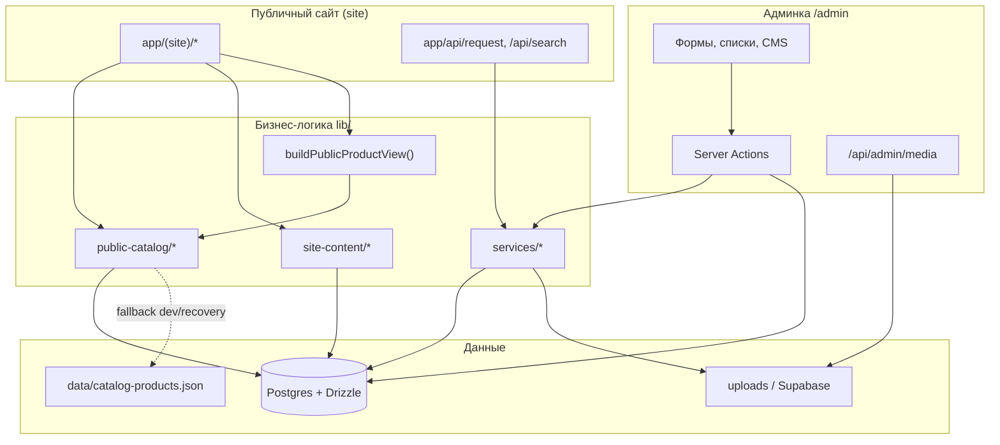
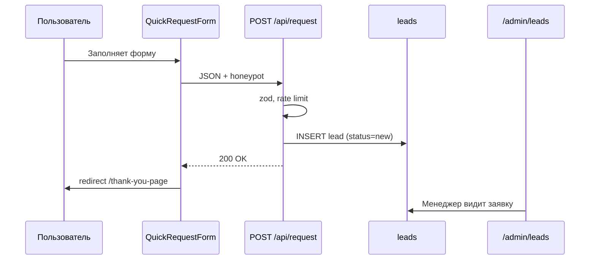

# Руководство для внешнего архитектора: публичный сайт и админка MANSVALVE GROUP

**Версия:** 2026-06-07  
**Аудитория:** внешний архитектор, техлид, senior-разработчик, SEO/продуктовый подрядчик  
**Репозиторий:** `mansvalve/` (Next.js 16 App Router)

Этот документ описывает, **как устроены публичный сайт и админка**, как данные проходят от редактирования до отображения, и какие архитектурные ограничения нельзя нарушать.

Для полной технической карты файлов и таблиц БД см. также:

- [`ARCHITECTURE.md`](../ARCHITECTURE.md) — полная архитектурная спецификация
- [`admin-public-content-map.md`](./admin-public-content-map.md) — карта CMS-полей
- [`admin-public-data-map.md`](./admin-public-data-map.md) — чеклист соответствия admin ↔ public
- [`product-content-contract.md`](./product-content-contract.md) — контракт текстов товара

---

## 1. Назначение системы

**MANSVALVE GROUP** — B2B-сайт поставщика промышленной трубопроводной арматуры в Казахстане.

Система объединяет:

| Подсистема | Назначение |
|---|---|
| **Публичный сайт** | Маркетинг, каталог, SEO-лендинги, карточки товаров, формы заявок |
| **Админка** | Управление товарами, категориями, CMS-текстами, медиа, сертификатами, заявками |
| **Каталог** | Категории → подкатегории → товары, фильтры, поиск, canonical URL |
| **CMS** | Редактируемые тексты и ссылки страниц через `content_blocks` |
| **SEO** | Metadata, canonical, JSON-LD, sitemap, robots, legacy redirects |
| **Аналитика** | GTM / Google Ads, события конверсий |

**Главный принцип:** публичный сайт, SEO, поиск, sitemap и preview в админке должны читать **один нормализованный слой данных**, а не собирать представление товара из сырых полей БД в каждом месте отдельно.

---

## 2. Высокоуровневая схема



### Разделение route groups

| Группа | Layout | Назначение |
|---|---|---|
| `app/layout.tsx` | Root: шрифты, GTM, JSON-LD, аналитика | Общий для всего домена |
| `app/(site)/layout.tsx` | Header, Footer, WhatsApp, motion | Только публичный маркетинг |
| `app/admin/layout.tsx` | Sidebar, guard сессии | Только админка, без публичной аналитики |
| `app/not-found.tsx` | Полный chrome | URL вне `(site)` |
| `app/(site)/not-found.tsx` | Только контент 404 | Внутри site layout (без дубля header) |

---

## 3. Публичный сайт: маршруты и ответственность

### 3.1. Статические и маркетинговые страницы

| URL | Компонент | Источник контента |
|---|---|---|
| `/` | `app/(site)/page.tsx` + секции | CMS `site.home.*`, каталог для витрин |
| `/about` | `about/page.tsx` | `site.page.about` |
| `/contacts` | `contacts/page.tsx` | `site.page.contacts` + `lib/company.ts` |
| `/delivery` | `delivery/page.tsx` | `site.page.delivery` |
| `/certificates` | `certificates/page.tsx` | `site.page.certificates` + таблица `certificates` |
| `/privacy`, `/terms` | соответствующие page | `site.page.privacy`, `site.page.terms` |
| `/thank-you-page` | thank-you page | Статика + аналитика конверсии |

Главная состоит из секций (`components/sections/*`): Hero, Categories, WhyUs, TrustStrip, ProductShowcaseCarousel, DeliveryCase, ContactHubSection и др. Каждая секция вызывает свой resolver из `lib/site-content/public.ts`.

### 3.2. Каталог

| URL | Назначение |
|---|---|
| `/catalog` | Общий листинг с фильтрами и поиском |
| `/catalog/[categorySlug]` | Страница категории |
| `/catalog/[categorySlug]/[subcategorySlug]` | Страница подкатегории |
| `/catalog/[slug]/[subcategorySlug]/[productSlug]` | Legacy nested product (редирект на canonical при необходимости) |
| `/catalog/category/[slug]` | **Legacy** → 308 на `/catalog/[slug]` |
| `/catalog/subcategory/[slug]` | **Legacy** → 308 на `/catalog/[cat]/[sub]` |
| `/tovar/[slug]` | **Канонический** шаблон карточки товара |

Фильтры каталога живут в query string: `q`, `category`, `subcategory`, `dn`, `pn`, `material`, `model`, `page` и др. Логика — `lib/catalog-query/engine.ts`, UI — `CatalogShell` + `CatalogFilters` (client).

### 3.3. SEO-лендинги

| Шаблон | Пример |
|---|---|
| `/[categorySlug]/[landingSlug]` | `/zadvizhki/30ch6br` |
| `/flancy/[landingSlug]` | `/flancy/ru16` |
| `/klapany/obratnye/[landingSlug]` | SEO-страницы обратных клапанов |

Конфигурация: `lib/catalog-seo.ts`, `lib/seo-product-pages/*`. Лендинг может влиять на canonical товара серии.

### 3.4. Публичные API

| Endpoint | Назначение |
|---|---|
| `POST /api/request` | Приём заявок с форм (zod, honeypot, rate limit) |
| `GET /api/search/products` | Подсказки поиска в шапке |

---

## 4. Админка: разделы и зона ответственности

Все маршруты `/admin/*` (кроме `/admin/login`) защищены JWT-сессией в httpOnly cookie (`proxy.ts` + server-side guard).

| Раздел | URL | Что редактирует | Куда пишет |
|---|---|---|---|
| **Обзор** | `/admin` | Dashboard | — |
| **Товары** | `/admin/products` | Список, фильтры, статусы | `products`, `product_images`, `product_specs` |
| **Новый / edit товар** | `/admin/products/new`, `[id]` | Полная карточка товара | Postgres |
| **Импорт** | `/admin/products/import` | Excel-прайс | `lib/products-import/*` → Postgres |
| **SEO-серии** | `/admin/products/series` | Серии для SEO-лендингов | Конфиг + связь с товарами |
| **Категории** | `/admin/categories` | Дерево категорий | `categories`, `subcategories` |
| **Сертификаты** | `/admin/certificates` | PDF/превью сертификатов | `certificates`, `media_assets` |
| **Контент** | `/admin/content` | Тексты главной, страниц, header/footer | `content_blocks` |
| **Заявки** | `/admin/leads` | CRM-lite по лидам | `leads` |
| **Медиа** | `/admin/media` | Библиотека файлов | `media_assets` + storage |
| **Здоровье каталога** | `/admin/catalog-health` | Диагностика расхождений | read-only |
| **Настройки** | `/admin/settings` | Company settings | `company_settings` |

### Поток сохранения в админке

```text
Форма админки
  → Server Action (app/admin/*/actions.ts)
    → requireAdmin()
    → zod validation
    → lib/services/*
    → Drizzle → Postgres
    → revalidatePath / revalidateTag (где настроено)
```

Клиентские проверки в админке **не считаются** защитой — только server action и edge guard.

---

## 5. CMS: как тексты попадают на сайт

### 5.1. Таблица `content_blocks`

| Поле | Описание |
|---|---|
| `key` | Стабильный идентификатор, напр. `site.home.hero` |
| `locale` | `ru` |
| `data` | JSONB с полями блока |

### 5.2. Ключи CMS (`lib/site-content/keys.ts`)

| Ключ | Публичная зона |
|---|---|
| `site.home.hero` | Hero главной |
| `site.home.productShowcases` | Slug товаров для витрин |
| `site.home.trustStrip` | Полоска доверия |
| `site.home.requestCta` | CTA заявки |
| `site.home.faq` | FAQ (также в Contact Hub) |
| `site.meta.home` | OG/title главной |
| `site.home.categories` | Тексты блока категорий |
| `site.home.whyUs` | «Почему мы» |
| `site.home.howItWorks` | «Как мы работаем» |
| `site.home.whoWeSupply` | «Кому поставляем» |
| `site.home.deliveryCase` | Кейсы поставок |
| `site.home.trust.*` | Логотипы, отзывы, кейсы, сертификаты preview |
| `site.header.topNav` | Верхнее меню |
| `site.footer.preCta` | Pre-footer CTA |
| `site.footer.trustBar` | Полоска преимуществ в футере |
| `site.footer.main` | Колонки каталога/компании, копирайт |
| `site.page.about` | Страница «О компании» |
| `site.page.contacts` | Страница «Контакты» |
| `site.page.delivery` | «Доставка» |
| `site.page.certificates` | Обёртка страницы сертификатов |
| `site.page.privacy`, `site.page.terms` | Юридические страницы |

### 5.3. Поток чтения на публичном сайте

```text
getContentBlock(key)           // lib/services/content-blocks.ts
  → merge*() + zod             // lib/site-content/models.ts
  → normalizeLegacyInternalHref()  // footer/header ссылки
  → resolve*()                 // lib/site-content/public.ts
  → Server Component / generateMetadata
```

**Безопасность:** если БД недоступна, публичные страницы используют `DEFAULT_*` константы из `models.ts` — сайт не падает.

**Нормализация ссылок:** `lib/legacy-internal-link-hrefs.ts` автоматически заменяет устаревшие href в footer/header (напр. `/catalog/subcategory/zatvory-diskovye` → `/catalog/zatvory/zatvory-diskovye`).

---

## 6. Каталог: источник данных и контракт товара

### 6.1. Выбор источника каталога

Переменные окружения (`lib/public-catalog/index.ts`):

| Режим | Условие |
|---|---|
| **DB (production)** | `DATABASE_URL` + `PUBLIC_CATALOG_SOURCE=db` (или по умолчанию) |
| **JSON (dev/recovery)** | `PUBLIC_CATALOG_SOURCE=json` или нет БД |

**Критично для production:** админка пишет в Postgres. Если сайт читает JSON fallback без явного recovery mode, менеджер видит сохранённые данные в админке, но не на сайте.

### 6.2. Единая точка чтения

Все публичные операции с каталогом — только через `lib/public-catalog/index.ts`:

```ts
getPublicCatalogCategories()
getPublicCatalogProducts()
getPublicProductBySlug(slug)
getPublicSubcategoryBySlug(slug)
// ...
```

### 6.3. Представление товара

**Единственная точка сборки публичного товара:** `buildPublicProductView()` в `lib/public-catalog/product-view.ts`.

Используется на:

- `/tovar/[slug]`
- SEO-лендингах задвижек
- карточках каталога (`ProductCard`)
- поиске
- JSON-LD
- preview в админке

| Поле в админке | Поле в БД | Публичное использование |
|---|---|---|
| Внутреннее название | `products.name` | Только админка |
| Публичное название | `products.public_title` | `displayName`, SEO, карточки |
| H1 override | `products.h1_override` | `<h1>` на странице |
| Slug | `products.slug` | URL (**не меняется** при переименовании) |
| Описания, блоки | `short_description`, `long_description`, `detail_blocks` | Секции карточки |
| Галерея | `product_images` | Primary image, OG |

Если `public_title` пустой — название **генерируется** по формуле DN/PN/модель/материал (`lib/catalog/product-naming.ts`), но не сохраняется в БД автоматически.

### 6.4. Canonical URL и legacy redirects

| Ситуация | Поведение |
|---|---|
| Обычный товар | Canonical: `/tovar/[slug]` |
| Товар серии задвижек | Может быть `/zadvizhki/[landingSlug]` |
| Старый slug товара | `product_slug_aliases` → 308 на новый |
| `/catalog/[productSlug]` | Legacy dispatcher → 308 на canonical |
| Старые подкатегории | `lib/catalog-subcategory-legacy-redirects.ts` |
| Старые footer/CMS ссылки | `lib/legacy-internal-link-hrefs.ts` |

**Запрещено:** fuzzy redirect на случайные товары; редирект всех 404 на главную.

---

## 7. Заявки (leads)



Сохраняемые поля: имя, телефон, email, комментарий, source, page, контекст товара, UTM/attribution, IP, User-Agent.

Telegram **удалён** из модели — заявки только в БД и админке.

---

## 8. Медиа и файлы

| Компонент | Назначение |
|---|---|
| `media_assets` | Метаданные файла (url, mime, size, alt) |
| `lib/storage/*` | Local filesystem или Supabase |
| `public/uploads/` | Файлы при local driver |
| `MediaUrlField` в админке | Выбор изображения для CMS и товаров |

**Production:** Nginx должен отдавать `/uploads/*` как static, иначе файлы могут отдавать 404 при существующем файле на диске.

---

## 9. SEO-инфраструктура

| Механизм | Файл |
|---|---|
| Sitemap | `app/sitemap.ts` → `/sitemap.xml` |
| Robots | `app/robots.ts` → `/robots.txt` |
| Metadata helpers | `lib/seo/metadata.ts` |
| JSON-LD | `lib/structured-data.ts`, `components/seo/JsonLd.tsx` |
| Legacy redirects | `lib/catalog-subcategory-legacy-redirects.ts`, route-level `permanentRedirect` |
| Canonical mirror | `proxy.ts` (www→non-www, lowercase) |

Sitemap включает: статические страницы, категории, подкатегории, canonical product URLs, SEO-лендинги. Не включает: admin, API, legacy duplicates, query-параметры фильтров.

---

## 10. Аналитика

- Подключение: `app/layout.tsx` (GTM / Google tag через `next/script`)
- Page views: `PageViewTracker` (без дубля с gtag auto page_view)
- Клики: `GlobalClickTracker` (телефон, WhatsApp, email)
- Конверсия формы: только после успешного ответа API
- `/admin/*` **исключён** из трекинга

Дефолтные ID заданы в `lib/analytics-config.ts`, переопределяются через `NEXT_PUBLIC_*` env.

---

## 11. Типичные сценарии работы

### 11.1. Менеджер меняет текст на главной

1. `/admin/content` → секция Home → Hero  
2. Server action → `content_blocks` key `site.home.hero`  
3. `revalidatePath` для `/`  
4. Публичная главная: `resolveHomeHero()` → новый текст

### 11.2. Менеджер добавляет товар

1. `/admin/products/new` → форма `ProductForm`  
2. Заполнение полей + загрузка изображений  
3. Save → `products` + `product_images`  
4. Публично: `getPublicProductBySlug` → `buildPublicProductView` → `/tovar/[slug]`

### 11.3. Менеджер меняет slug товара

1. Старый slug записывается в `product_slug_aliases`  
2. Старый URL `/tovar/old-slug` → 308 → `/tovar/new-slug`  
3. Sitemap обновляется при следующей генерации (revalidate)

### 11.4. Пользователь оставляет заявку с карточки товара

1. `QuickRequestForm` с контекстом товара  
2. `POST /api/request`  
3. Lead в `/admin/leads` со статусом `new`  
4. Редирект на `/thank-you-page` + событие конверсии

### 11.5. Google ведёт на старый URL подкатегории

1. Запрос `/catalog/zadvizhki/chugunnye-flantsevye-zadvizhki`  
2. `CatalogSubcategoryPage` → `resolveLegacyNestedSubcategoryCanonicalPath`  
3. HTTP **308** → `/catalog/zadvizhki/zadvizhki-chugunnye`

---

## 12. Скрипты проверки (для архитектора и CI)

| Команда | Назначение |
|---|---|
| `npm run build` | Production build, typecheck |
| `npm run lint` | ESLint |
| `npm run catalog:parity-check` | Соответствие JSON ↔ DB каталога |
| `npm run catalog:slug-check` | Коллизии slug |
| `npm run catalog:legacy-redirect-check` | Валидность legacy redirect targets |
| `npm run links:audit` | Crawl внутренних ссылок (нужен `npm run start`) |
| `npm run seo:audit` | Title/description/h1 на ключевых URL |

Для production audit:

```bash
LINKS_AUDIT_BASE_URL=https://mansvalve-group.kz npm run links:audit
```

---

## 13. Ограничения для внешнего архитектора

При проектировании изменений **нельзя** без согласования:

1. Менять canonical-стратегию товаров (slug architecture).
2. Обходить `buildPublicProductView()` для публичного отображения товара.
3. Читать каталог напрямую из сырых таблиц в UI-компонентах.
4. Делать client components с импортом server-only services.
5. Включать silent JSON fallback в production при настроенной БД.
6. Массово редиректить неизвестные 404 на главную.
7. Дублировать phone/WhatsApp ссылки в UI вместо `lib/company.ts`.
8. Ломать существующие legacy redirects и `product_slug_aliases`.
9. Менять sitemap/robots без SEO-ревью.
10. Добавлять второй CMS-слой поверх `content_blocks`.

**Рекомендуется** при любых изменениях каталога/URL:

- обновить `catalog-legacy-redirect-check` и `links:audit`;
- проверить footer/header normalization;
- убедиться, что admin save → public read идут через один adapter.

---

## 14. Переменные окружения (ключевые)

| Переменная | Назначение |
|---|---|
| `DATABASE_URL` | Postgres connection |
| `PUBLIC_CATALOG_SOURCE` | `db` \| `json` |
| `PUBLIC_CATALOG_RECOVERY_MODE` | Явный JSON recovery |
| `STORAGE_DRIVER` | `local` \| `supabase` |
| `NEXT_PUBLIC_GTM_ID` | Google Tag Manager |
| `NEXT_PUBLIC_GOOGLE_TAG_ID` | Google Ads tag |
| `SITE_URL` | Canonical base URL |
| `ADMIN_SESSION_SECRET` | JWT для админ-сессии |

Полный список: `.env.example`.

---

## 15. Карта файлов для быстрого старта

| Задача | С чего начать |
|---|---|
| Публичная страница | `app/(site)/*/page.tsx` |
| Секция главной | `components/sections/*.tsx` |
| CMS resolver | `lib/site-content/public.ts` |
| CMS defaults | `lib/site-content/models.ts` |
| Админ-форма | `app/admin/*/page.tsx`, `components/admin/*` |
| Server action | `app/admin/*/actions.ts` |
| Каталог read | `lib/public-catalog/index.ts` |
| Товар view | `lib/public-catalog/product-view.ts` |
| SEO metadata | `lib/seo/metadata.ts` |
| Редиректы | `lib/catalog-subcategory-legacy-redirects.ts` |
| Auth | `proxy.ts`, `lib/auth/*` |
| Схема БД | `lib/db/schema.ts` |

---

## 16. Чеклист после деплоя (для архитектора)

- [ ] `PUBLIC_CATALOG_SOURCE=db` и каталог на сайте совпадает с админкой
- [ ] Footer-ссылки открываются с 200 (или 308→200)
- [ ] Старые Google URL из legacy-таблицы редиректят 308
- [ ] `/tovar/[slug]` и поиск возвращают актуальные товары
- [ ] Форма заявки → lead в `/admin/leads` → `/thank-you-page`
- [ ] `/admin` закрыт от индексации, сессия работает
- [ ] `/uploads/*` отдаются в production
- [ ] `npm run links:audit` на production URL — 0 broken
- [ ] 404: одна шапка, кнопки «В каталог» / «На главную»

---

*Документ поддерживается вместе с [`ARCHITECTURE.md`](../ARCHITECTURE.md). При расхождении приоритет у актуального кода; обновляйте этот файл при изменении admin/public контрактов.*
